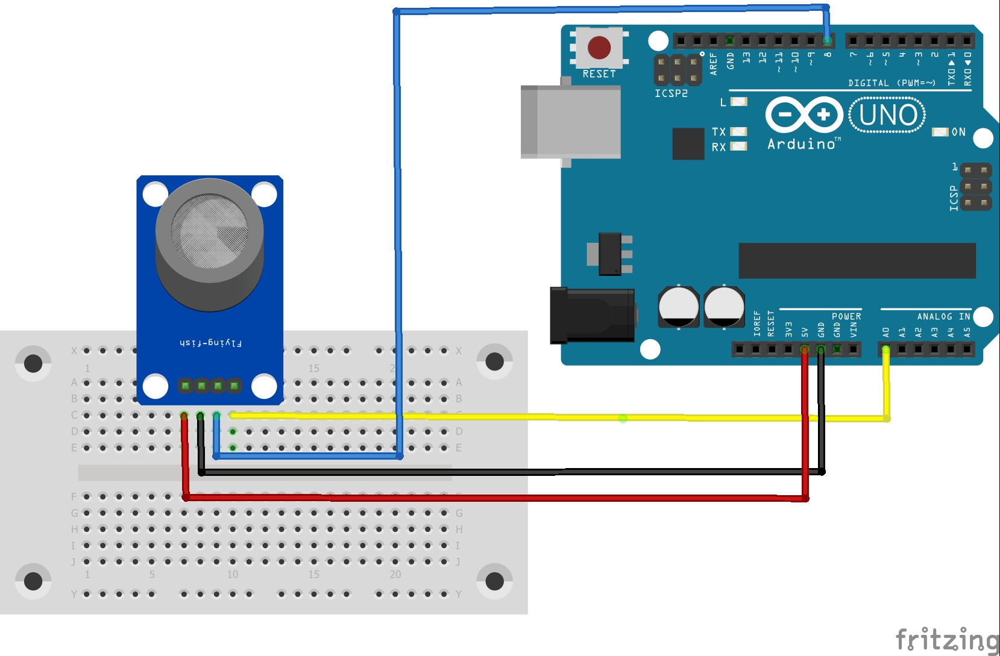

## خواندن مقادیر از سنسور MQ5 و نمایش آن در سریال مانیتور

در این آزمایش ما یک سنسور MQ5 داریم که با استفاده از آن میتوانیم دود و گاز را اندازه بگیریم و مقدار آن را در سریال مانیتور نمایش دهیم

کد ما به شرح زیر است :
```c++
void setup() {
  Serial.begin(9600);
}

void loop() {
  float sensorValue;

  for(int x = 0; x < 100; x++){
    sensorValue = analogRead(A0);
  }
  Serial.print("sensor value : ");
  Serial.print(sensorValue);
  Serial.println("V");
  delay(1000);
}

```

### شماتیک مدار :




